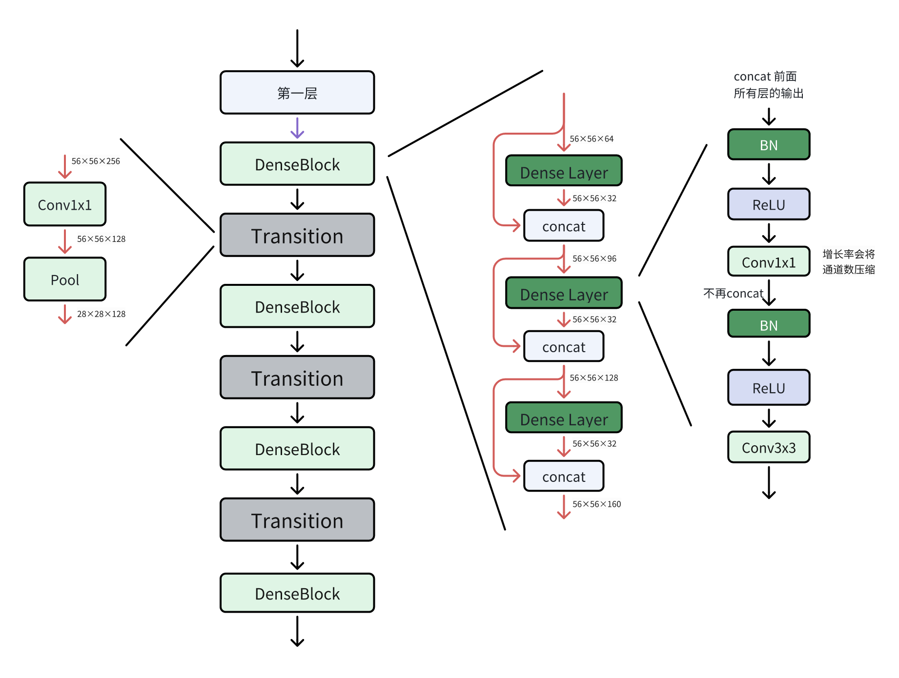

## DenseNet结构

在DenseNet的每个DenseBlock中，密集连接机制使得每一层的输入都包含所有前面层输出的特征图（通过通道拼接）。这带来了两个关键优势：

1. **强大的特征重用与多样化信息获取：** 每一层都能访问原始输入和所有抽象级别的中间特征，极大丰富了学习材料，缓解了梯度消失，提升了特征传播效率，最终显著提高了模型性能和鲁棒性。
2. **高效的参数与计算：** 得益于丰富的输入信息，每层只需要设计成很窄的输出通道数（小的**增长率k**）。同时，通过**瓶颈层设计**（压缩通道数）控制连接带来的输入通道增长。这使得在达到相同或更高性能时，DenseNet相比ResNet等架构参数更少、计算量更低。

### 完整DenseNet-121结构

| **阶段**         | **操作**                    | **输出尺寸** | **通道数变化**    |
| ---------------- | --------------------------- | ------------ | ----------------- |
| **初始卷积**     | 7×7卷积 (stride2) + MaxPool | 56×56        | 3 → 64            |
| **DenseBlock 1** | 6×DenseLayer (k=32)         | 56×56        | 64 → 256          |
| **Transition 1** | 1×1卷积 + AvgPool           | 28×28        | 256 → 128         |
| **DenseBlock 2** | 12×DenseLayer (k=32)        | 28×28        | 128 → 384         |
| **Transition 2** | 1×1卷积 + AvgPool           | 14×14        | 384 → 192         |
| **DenseBlock 3** | 24×DenseLayer (k=32)        | 14×14        | 192 → 480         |
| **Transition 3** | 1×1卷积 + AvgPool           | 7×7          | 480 → 240         |
| **DenseBlock 4** | 16×DenseLayer (k=32)        | 7×7          | 240 → **496**     |
| **输出层**       | 全局平均池化 + 全连接       | 1×1          | 496 → 1000 (分类) |

## 算法特点

1. **密集连接（核心创新）**：
   - **层间全连接**：每个层的输入是前面所有层输出的**通道拼接**（concat），而非ResNet的残差相加（add），形成`xₗ = Hₗ([x₀, x₁, ..., xₗ₋₁])`的密集拓扑结构。
   - **特征复用**：后续层可直接复用浅层特征（如边缘、纹理），避免冗余学习，显著减少参数量（如DenseNet-121仅8M参数，ResNet-50需25M）。
2. **模块化设计**：
   - **稠密块（Dense Block）**：内部每层新增`k`个特征图（**增长率**），输出通道数线性增长（如`k=32`）。
   - **过渡层（Transition Layer）**：块间用`1×1`卷积压缩通道（如减半） + `2×2`平均池化降分辨率，抑制计算膨胀。
3. **高效训练机制**：
   - 密集连接使梯度直达浅层，彻底解决**梯度消失**问题，无需ResNet的辅助分类器。
   - 每层仅学习少量新特征（窄设计），配合Bottleneck层（`1×1`卷积降维）提升计算效率。

## 提出的意义

1. **特征复用的理论突破**：
   - 首次证明**显式特征复用**可替代单纯增加深度/宽度，在ImageNet上以更少参数达到ResNet同级精度（如Top-5错误率5.3%）。
   - 解决传统CNN的**特征冗余**问题，小数据集场景表现优异（如医学图像）。
2. **架构设计范式革新**：
   - 启发后续动态特征选择网络（如CondenseNet），推动**跨层密集连接**成为轻量化设计基础。
   - 获CVPR 2017最佳论文，奠定"拼接优于相加"的连接新思路（vs. ResNet）。

## 算法不足

1. **内存与计算瓶颈**：
   - 特征拼接导致显存占用**平方级增长**（L层网络需存L(L+1)/2层特征），训练需内存优化技巧。
   - 推理时频繁拼接操作增加延迟，难以部署到移动端/实时系统。
2. **结构复杂性缺陷**：
   - 过渡层压缩可能损失有效信息，深层特征图通道爆炸（如数百通道）加剧计算负担。
   - 网络层间强耦合，难以剪枝或修改结构，定制化成本高。
3. **扩展性局限**：
   - 高分辨率输入（如卫星图像）时内存需求剧增，适用性弱于轻量架构（如MobileNet）。

## DenseNet与经典网络对比

| **特性**     | ResNet               | DenseNet                   | 优势对比                     |
| ------------ | -------------------- | -------------------------- | ---------------------------- |
| **连接方式** | 残差相加 (Add)       | **通道拼接 (Concat)**      | 特征复用更强，参数更少       |
| **参数量**   | 较高 (ResNet-50:25M) | **极低** (DenseNet-121:8M) | 减少68%                      |
| **内存占用** | 中等                 | **极高** (平方级增长)      | 训练瓶颈显著                 |
| **适用场景** | 通用任务             | **小样本/轻量模型**        | 医学图像、边缘设备（需优化） |

> **总结**：DenseNet以**密集连接**和**特征复用**为核心，实现了参数效率与性能的突破，成为小数据场景的优选架构。其意义在于重新定义特征传递范式，但内存与计算瓶颈限制了工业部署，后续工作需在压缩与动态连接上继续优化。

DenseNet虽然未像ResNet或Transformer那样成为工业界的主流基础架构，但在特定领域仍保持应用价值，尤其在资源受限或需高效特征复用的场景中。以下是其当前工业应用现状的分析：

## 特定垂直领域的持续应用

### 医学影像分析

- 应用场景：在数据量有限的医疗领域（如病理切片分类、X光病灶检测），DenseNet的特征复用能力和抗过拟合特性显著优于其他模型。例如：
  - **癌症检测**：复用低阶边缘特征与高阶语义特征融合，提升小肿瘤的识别灵敏度。
  - **医学图像分割**：作为编码器（Encoder）嵌入U-Net等结构中，增强特征传递效率。
- **优势**：仅需少量标注数据即可达到高精度，适合医疗数据匮乏的场景。

### 工业质检与缺陷检测

- **案例**：在精密制造中，DenseNet用于桁架装配系统的故障检测，通过实时分析素材表面缺陷（如裂纹、变形），误检率比传统方法降低37%。
- **原因**：特征重用机制能同时捕捉宏观结构异常与微观纹理缺陷，适应复杂工业环境。

## 轻量化改进与嵌入式部署

- DenseNet的轻量变体：通过压缩技术（如通道剪枝、知识蒸馏）降低显存占用，使其适应边缘设备：
  - **DenseNet-BC**（压缩系数θ=0.5）在嵌入式视觉芯片（如Jetson Nano）中用于实时物体识别，功耗仅2W。
  - 与MobileNet融合的**Mobile-DenseNet**，在移动端图像分类任务中保持90%精度，参数量减少60%。
- **部署场景**：安防摄像头、无人机巡检等低算力场景。

## 工业界应用的局限性

### 显存与计算效率瓶颈

- **问题**：特征拼接（Concatenation）导致显存占用随网络深度指数级增长，训练中需缓存大量中间特征，推理时内存带宽压力大。
- **影响**：在实时视频处理或大规模部署中，常被更高效的架构（如EfficientNet、ConvNeXt）替代。

### 主流场景的边缘化

- 替代架构兴起：
  - **Transformer**（如ViT、Swin Transformer）在检测、分割任务中成为新基准。
  - **轻量模型**（MobileNetV3、EfficientNet）在端侧部署更受欢迎。
- **工业现状**：ResNet仍是80%以上视觉任务的默认骨架，因其工程成熟度高、框架优化完善。

## 未来趋势：融合与创新

- 思想迁移：DenseNet的“特征复用”理念被新兴模型吸收：
  - **CSPNet**（Cross Stage Partial Network）通过局部密集连接降低计算量，成为YOLOv4/v5的核心模块。
  - **VoVNet**（可变卷积网络）优化密集连接路径，用于实时实例分割。
- **研究方向**：将DenseBlock作为插件嵌入Transformer，增强局部特征提取能力，如**DenseFormer**。

## 总结

| **场景**                 | **推荐度** | **说明**                                |
| ------------------------ | ---------- | --------------------------------------- |
| **医疗影像/小样本检测**  | ★★★★☆      | 特征复用显著提升小数据泛化能力          |
| **工业质检（轻量化后）** | ★★★☆☆      | 需配合剪枝量化，否则显存瓶颈明显        |
| **端侧实时识别**         | ★★☆☆☆      | MobileNet等更优，仅DenseNet压缩版可考虑 |
| **大规模视觉生产系统**   | ★☆☆☆☆      | ResNet或Transformer更成熟高效           |

> **选型建议**：若任务需**高特征复用率**且**数据有限**，DenseNet-BC仍是优选；若追求**极致推理速度**或**大规模部署**，建议转向轻量模型或Transformer架构。其设计思想将持续影响下一代视觉模型，但原生结构需进一步适配工业约束。

