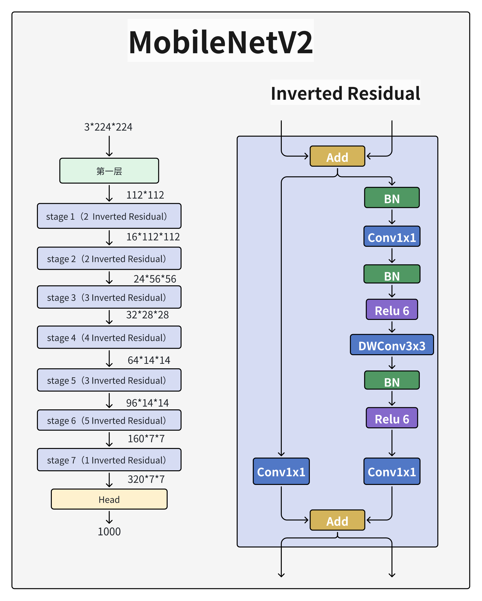

## 模型架构原理

### 核心创新：深度可分离卷积（Depthwise Separable Convolution）

- **传统卷积问题**：标准卷积同时处理空间特征（图像局部信息）和通道特征（跨通道组合），计算量大。

- **MobileNet 的解决方案**：

  - 深度卷积（Depthwise Convolution）：

    每个输入通道独立进行空间卷积（如 3×3 卷积），仅提取空间特征，输出通道数 = 输入通道数。

    计算量：
    $$
    D_K*D_K*M*D_F*D_F
    $$
    （DK=卷积核尺寸，M=输入通道数，DF=特征图尺寸）。

  - 逐点卷积（Pointwise Convolution）：

    使用 1×1 卷积组合深度卷积的输出通道，生成新特征图。

    计算量：
    $$
    1*1*M*N*D_F*D_F
    $$
    （N=输出通道数）。

- 总计算量对比：

  - 标准卷积：
    $$
    D_K*D_K*M*N*D_F*D_F
    $$

  - 深度可分离卷积：
    $$
    D_K*D_K*M*N*D_F*D_F + M*N*D_F*D_F
    $$
    计算量减少约：
    $$
    \frac{1}{N} + \frac{1}{{D_K}^2}
    $$
    （典型值：8~9倍）。

### 超参数控制模型大小

- 宽度因子（Width Multiplier, α）：按比例减少所有层的通道数（如 *α*=0.5 时通道数减半）。
- 分辨率因子（Resolution Multiplier, *ρ*）：降低输入图像分辨率（如 224×224 → 192×192）。二者结合可灵活平衡精度与计算效率（例如α*=0.25,*ρ=0.714时计算量降至标准 MobileNet 的 10%）

##  为何有效？

1. 解耦空间与通道特征学习：
   - DW卷积专注**空间相关性**（边缘、纹理），PW卷积专注**通道相关性**（特征组合）。
2. 1×1卷积的高效性：
   - 占整体计算量95%，可直接用GEMM（通用矩阵乘）优化，无需`im2col`内存重排。
3. 硬件友好：
   - 减少内存带宽需求，适配移动设备低功耗特性。

## 版本演进与核心改进

### MobileNetV1：奠基轻量化

- **结构**：28层深度可分离卷积堆叠，无池化层（使用步长=2的卷积降采样）。

- 激活函数：ReLU6增强低精度设备鲁棒性
  $$
  y=min(max(0,x),6)
  $$

- 局限：深度卷积层易出现“特征退化”（ReLU 对低维特征造成信息丢失）。

### MobileNetV2：倒残差与线性瓶颈

- 倒残差结构（Inverted Residuals）：先通过 1×1 卷积扩张通道（扩展因子t=6），再深度卷积，最后 1×1 卷积压缩通道。
- 设计逻辑：在高维空间进行非线性变换ReLU6），避免信息损失。
- 线性瓶颈（Linear Bottleneck）：压缩层的 1×1 卷积不使用 ReLU，保留完整特征信息。
- 效果：参数量减少 30%，ImageNet 准确率提升 3%。

### MobileNetV3：自动化搜索与注意力机制

- 神经架构搜索（NAS）：自动优化网络层数、卷积核尺寸等超参数。

- SE 模块（Squeeze-and-Excitation）：添加通道注意力机制，动态加权重要通道。

- h-swish 激活函数：
  $$
  h-swish(x) = x*\frac{ReLU6(x+3)}{6}
  $$
  

  替代计算复杂的 Sigmoid，兼顾速度与精度。

- **结构优化**：减少首尾卷积层的冗余计算（如输入层通道数从 32 压缩至 16）

