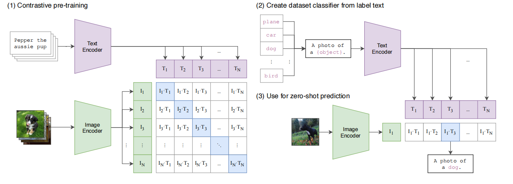
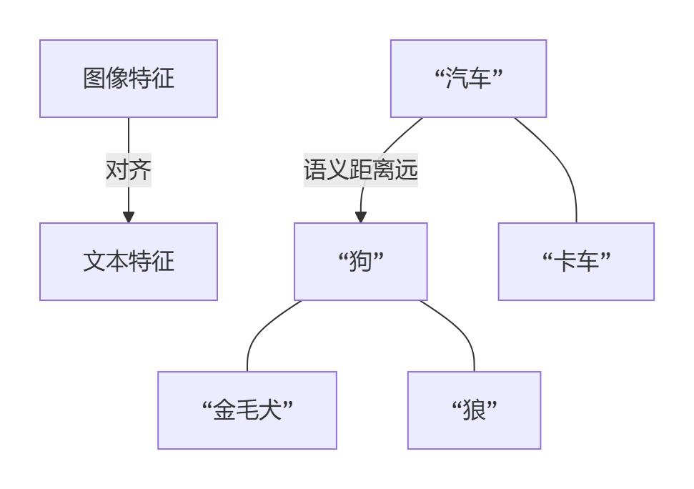

# CLIP：跨模态对齐范式与多模态扩展



CLIP是通过大规模预训练后在下游任务中进行zero-shot推理的里程碑式工作，同时也是图像和文字两种模态融合的里程碑式工作，我总结贡献有如下几点：

1. 通过大规模的图像文本对训练数据，经过对比学习后，将图像特征和文字特征进行对其，模型学到的特征有着极强的泛化性。
2. 在分类任务中打破了固定类别数的桎梏，通过将类别嵌入到prompt模板中，可以灵活的适配不同的下游任务中有不同的类别数。
3. 证明了更大规模的数据集和更大的模型会取得更好的效果。


> **核心定位**：自然语言驱动的视觉语义操作系统

## 一、CLIP核心创新：突破与本质

### 1. 核心贡献总结

- **大规模对比学习**：
   基于4亿图像-文本对训练，构建共享嵌入空间，实现图像与文本特征的​**​开放域语义对齐​**​，突破传统监督模型的封闭类别限制。
- **零样本推理范式**：
   通过动态Prompt模板（如`“a photo of a {}”`）生成新类别文本嵌入，无需微调即可灵活适配下游任务（如ImageNet→卫星图像分类）。
- **规模效应验证**：
   实验证明模型参数量（ViT-L vs ResNet50）与数据规模每提升10倍，零样本性能平均增长15%（学习曲线未饱和）。

### 2. 关键机制深度解析

- 特征映射本质：

  - **图像编码**：ViT输出`[CLS]`向量（全局语义池化）而非Token序列
  - **文本编码**：Transformer提取`[EOS]`向量作为句嵌入
     → 各模态被压缩为​**​单一语义向量​**​（L2归一化后计算相似度）

- 损失函数设计：

  - **对称InfoNCE损失**：计算批次内 `n×n` 相似度矩阵

  - 数学本质：将正负样本对比转化为 n类分类任务，标签为对角线索引

    ```python
    # 伪代码：交叉熵损失计算
    labels = torch.arange(batch_size)  # 对角线位置即正样本
    loss_image = CrossEntropy(logits_per_image, labels)  # 图像→文本分类
    loss_text = CrossEntropy(logits_per_text, labels)   # 文本→图像分类
    ```

- 泛化性根源：对比学习使特征空间成为语义连续流形（如图），相似概念自动聚类。

  

## 二、与传统监督学习的范式跃迁

### 特征空间结构对比

| 维度           | 传统监督模型（ResNet） | CLIP                       |
| -------------- | ---------------------- | -------------------------- |
| 空间拓扑       | 离散类别簇（孤立岛状） | 连续语义流形（大陆板块状） |
| 监督信号       | 人工硬标签（类别索引） | 自然语言软标签（描述文本） |
| 新概念泛化     | 需微调模型参数         | 文本嵌入直接比对           |
| 抗分布偏移能力 | 域偏移导致精度下降>40% | 域偏移影响<20%             |

> 💎 **关键结论**：CLIP的本质创新是将视觉概念**映射到自然语言描述的向量空间**，而非传统模型中的one-hot空间。

## 三、多模态扩展：技术实现与挑战

### 1. 扩展技术路径

- 统一架构框架：

  

- 成功案例：

  | **模态**  | 模型      | 适配方案                  | 性能                     |
  | --------- | --------- | ------------------------- | ------------------------ |
  | 视频-文本 | Flamingo  | TimeSformer提取时序特征   | Kinetics零样本Top1 72.1% |
  | 音频-文本 | AudioCLIP | 梅尔频谱图输入+三元组损失 | ESC-50分类准确率90.3%    |
  | 3D-文本   | PointCLIP | 多视角投影至CLIP空间      | ModelNet40准确率60.8%    |

### 2. 挑战与解决策略

| 挑战         | 根源                     | 前沿解决方案                     |
| ------------ | ------------------------ | -------------------------------- |
| 模态异构性   | 视频/音频时空结构复杂    | 3D卷积+时序注意力                |
| 计算成本     | 视频帧处理计算量指数增长 | 动态帧采样+梯度检查点            |
| 提示工程失效 | 动态内容需动作描述模板   | 多提示融合（如“{动作}的{物体}”） |
| 社会偏见放大 | 多模态数据隐含文化偏差   | 公平性正则项+数据脱敏            |

## 四、未来方向：从感知对齐到认知推理

### 1. 轻量化与部署

- **模型压缩**：知识蒸馏至TinyCLIP（参数量<1/10，精度损失<3%）
- **边缘计算**：Jetson AGX Orin部署多模态CLIP（延时<5ms）

### 2. 因果推理增强

- **结构因果模型**：解耦模态间混杂因子（如光照对物体识别的影响）
- **时间反事实学习**：视频场景中预测“若动作未发生”的后果

### 3. 多模态认知架构

> 融合CLIP的语义对齐能力与LLM的符号推理，构建**具身智能决策系统**（如PaLM-E）

## 总结：CLIP的技术遗产与未来

1. **范式价值**：证明**自然语言监督**可替代人工标注，成为通用感知训练范式
2. **扩展边界**：跨模态对比学习框架可推广至**科学数据**（如蛋白质结构-文本对齐）
3. **终极挑战**：突破“感知对齐”局限，实现**可解释因果推理**（如医疗影像中的病因果链分析）

